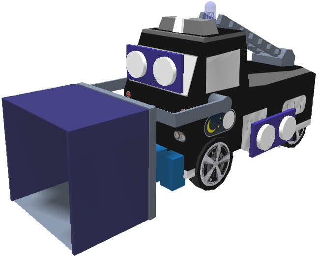
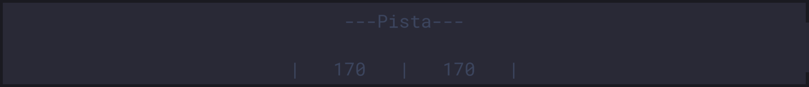
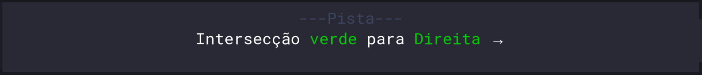
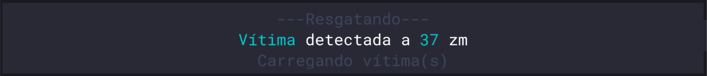
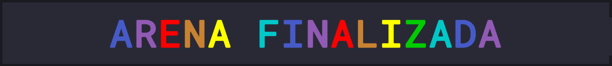

# **Código da equipe D4RKMODE - OBR Nacional**

Não é permitida de nenhuma forma a cópia do contéudo aqui presente para uso em competição. Esteja avisado.

 

## **Organização**

Este projeto utiliza uma estrutura de multíplos arquivos em Rust denominada `sBotics-file-modulator`.

Dentro de `./src` estão todos os scripts responsáveis pelas ações do robô, divididos em "geral/pista/resgate/terminar"

A pasta `./out` contém o resultado da junção dos arquivos que é executado na rotina -> `final.cs`

## **Robô**

 

&nbsp;

### **Robô 3 (bombeiro)**

#### **Empilhadeira Frontal**

## **LED**

O LED é usado como um indicador de posição, as cores mudam a depender de onde o robô está e o que está fazendo. Abaixo está a referência das cores.

## **Console**

O Console também é usado para indicar o que o robô está fazendo. Algumas informações relevantes:

	Indicação de local <b>(Pista)</b> e Informação extra <b>(Velocidade dos motores)</b>
	
	 
	Indicação de local <b>(Pista)</b> e Ação <b>(Intersecção)</b>
	
	 
	Indicação de local <b>(Resgate)</b>, Ação <b>(Vítima detectada)</b> e Informação extra <b>(Carregando vítima)</b>
	
	 
	E um pouco de diversão haha
	

